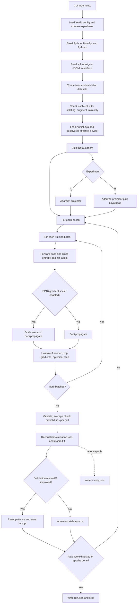
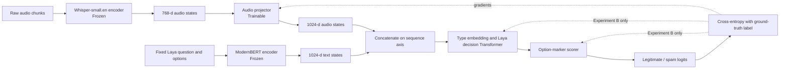

# Audio-Laya — Direct Speech-to-Decision PoC

English-only PoC for classifying a call as `legitimate` or `spam` directly from audio. Default inference uses audio only. An optional semantic-alignment experiment uses paired source transcripts during training only.

```text
16 kHz mono call audio
  -> frozen Whisper-small.en encoder (768)
  -> trainable projector (768 -> 1024)
  -> append to frozen ModernBERT text states
  -> Laya decision head
  -> P(legitimate), P(spam)
```

At inference, the fixed text input is only the Laya question/options (`Is this call a robocall?`, `legitimate`, `spam`) and a short task prompt. Projected audio states are appended on the sequence axis **after ModernBERT** and before Laya's two-layer decision Transformer. Whisper's decoder is never called on this path. Audio padding positions are masked; each call is split only after call-level data splits are assigned.

## Setup

Python 3.10+. Install a PyTorch build appropriate for your machine, then:

```bash
python -m venv .venv
. .venv/bin/activate
python -m pip install -r requirements.txt
```

The first run downloads `openai/whisper-small.en` and `convaiinnovations/laya` from Hugging Face. Training keeps both encoders frozen and uses a small batch size because 30 seconds of Whisper output can contain 1,500 audio tokens.

## Data

Clone the two source datasets locally (audio is not redistributed here):

```bash
git clone https://github.com/wspr-ncsu/robocall-audio-dataset.git data/raw/ftc
git -C data/raw/ftc checkout 5aa6f3bfa8563ce8c1c75ebf8a2271e6ff6b4272
git clone https://github.com/cricketclub/gridspace-stanford-harper-valley.git data/raw/harper
git -C data/raw/harper checkout 0bd721e877c4a85d8c13ff837e68661ea6200a98
python -m src.data.prepare_ftc --root data/raw/ftc
python -m src.data.prepare_harper --root data/raw/harper
```

The FTC manifest keeps English caller/remote-side samples (`label=1`); Harper uses caller-side recordings only (`label=0`). Each preparation script assigns 80/10/10 splits to original call IDs. `CallAudioDataset` creates non-overlapping chunks up to 30 seconds only after reading those splits, so chunks from a call cannot cross splits. Manifests contain local absolute audio paths. They also carry optional source transcripts for semantic training; the dataset ignores them unless `include_semantic_text=True`.

**Benchmark caveat:** all positive examples come from FTC and all negative examples from HarperValleyBank. Corpus, recording, and label are therefore confounded. A random call-level test split is useful for an architecture smoke test, but high scores would not establish robust spam detection or real-world generalization. Use matched sources / both labels within each source and a source-disjoint evaluation before making that claim.

## Experiments

```bash
# A: train projector only; keep Laya's type embedding, decision Transformer and scorer frozen
python -m src.train --experiment projector_only

# B: train projector plus Laya's type embedding, decision Transformer and option scorer
python -m src.train --experiment projector_head

# Test evaluation and figures
python -m src.evaluate --checkpoint runs/projector_head/best.pt

# Direct audio inference (no ASR)
python -m src.inference path/to/call.wav --checkpoint runs/projector_head/best.pt

# C: transcript baseline (Whisper ASR -> standard Laya API)
python -m src.transcript_baseline
```

## `train.py` flow

### Training loop



### One batch: model forward and gradient path



Experiment A updates only the projector; Experiment B also updates Laya's type embedding, decision Transformer, and option scorer. Neither encoder is updated. At inference, both direct-audio paths use no transcript.

Training defaults are in [`configs/poc.yaml`](configs/poc.yaml). Early stopping monitors validation call-level macro F1 (patience 3); chunk probabilities are averaged per original call for reported metrics. Training writes `best.pt`, `history.json`, and `run.json`. Evaluation writes `metrics.json`, `confusion_matrix.png`, `roc_curve.png`, and `loss_curve.png` under `results/`.

| Model | Whisper | Projector | Laya decision head | Transcript | Trainable params | Macro F1 | AUROC |
|---|---|---|---|---|---:|---:|---:|
| C: Transcript baseline | ASR | — | frozen standard model | Yes | 0 | 0.892 | 0.949 |
| A: Projector only | frozen | train | frozen | No | 1,838,592 | 0.996 | 1.000 |
| B: Projector + head | frozen | train | train | No | 28,086,785 | 1.000 | 1.000 |

"Trainable params" counts only the parameters updated by each method. It is not deployed model size: Laya itself is a 421M-parameter model, and both Whisper and Laya stay loaded at inference.

These are results on the same 282-call internal test split (146 Harper legitimate, 136 FTC spam; 576 chunks). A and B use the direct-audio path; C generates an in-memory Whisper transcript and sends it to standard Laya. The test labels are fully confounded with dataset source, so these scores are pipeline comparisons only—not evidence of real-world spam detection. Metrics are in `results/projector_only/metrics.json`, `results/metrics.json` (B), and `results/transcript_baseline.json` (C). C is about 11–14× slower per call than the direct-audio models on this test split (762 ms vs. 55–71 ms); exact latency depends on audio length and hardware.

### External AppTek evaluation

| Model | False alarms on 14 legitimate calls | False-positive rate | Transcript |
|---|---:|---:|---|
| A: Projector only | 0/14 | 0% | No |
| B: Projector + head | 0/14 | 0% | No |
| C: Transcript baseline | 0/14 | 0% | Yes |

All 14 samples are customer-side role-played service calls, one per accent. This is a small normal-only evaluation: it can estimate false alarms on this sample, but cannot yield balanced accuracy, F1, AUROC, or a robust real-world false-positive rate. Laya also emitted a calibration warning, so its class probabilities should not be interpreted as calibrated confidence. Detailed results: `results/external_apptek/abc_comparison.json`.

## Cross-task zero-shot transfer

To probe generalization beyond robocall detection, A/B checkpoints were evaluated on two unseen audio tasks **without training or tuning on target-task labels**. The task prompt and answer options are changed at inference time. A/B still consume audio directly; C uses Whisper ASR followed by the unmodified, pretrained Laya text API. On MInDS-14, a reference-transcript-to-Laya control is also reported; it is an oracle text-input comparison, not an audio-only method. This is not a matched-supervision comparison between modalities.

| Target task | Method | N | Accuracy | Balanced accuracy | Macro F1 | Macro AUROC (OvR) |
|---|---|---:|---:|---:|---:|---:|
| MInDS-14, 14 banking intents | A: Projector only | 563 | 0.080 | 0.068 | 0.014 | 0.497 |
|  | B: Projector + head | 563 | 0.062 | 0.055 | 0.029 | 0.490 |
|  | C: Whisper ASR → Laya | 563 | 0.936 | 0.936 | 0.937 | 0.993 |
|  | C: reference transcript → Laya | 563 | 0.909 | 0.912 | 0.911 | 0.990 |
| Urgency tone, English | A: Projector only | 40 | 0.450 | 0.450 | 0.437 | 0.518 |
|  | B: Projector + head | 40 | 0.725 | 0.725 | 0.703 | 0.998 |
|  | C: Whisper ASR → Laya | 40 | 0.975 | 0.975 | 0.975 | 1.000 |

**What this suggests:** the binary spam-trained direct-audio A/B checkpoints did not transfer zero-shot to 14-way intent classification: both mostly predicted `cash_deposit` (A: 498/563; B: 386/563), and their accuracy was below the MInDS majority-class baseline (0.085). C performed strongly through text on these test sets. On urgency, B's AUROC is high, but it predicts only 9/20 urgent examples at the default decision threshold; C gets 19/20 on this small set.

**Limits:** MInDS-14 has only an `en-US/train` release (563 samples), not an official held-out test split; the full release was used as a zero-shot scoring set, with no target-task training. Its majority baseline is 0.085 accuracy / 0.011 macro F1. The urgency majority baseline is 0.500 accuracy / 0.333 macro F1; A falls below it in accuracy. The urgency probe is only 40 English AI-TTS clips (20 per label); its emergency content and urgent delivery can both reveal the label, so it is not evidence of real-call urgency recognition. Laya emitted a calibration warning; scores are not calibrated confidence. Only audio and transcript-text paths were tested—not image, video, or arbitrary input modalities.

Task configs: `configs/transfer_minds14.json`, `configs/transfer_urgency.json`. Reproduce with:

```bash
python -m src.transfer_eval --task configs/transfer_minds14.json --out results/transfer/minds14_zero_shot.json
python -m src.transfer_eval --task configs/transfer_urgency.json --skip-gold-transcript --out results/transfer/urgency_zero_shot.json
```

Provenance and preprocessing notes are in `data/raw/external/minds14/README.md` and `data/raw/external/urgency-tone/README.md`; complete metrics and confusion matrices are in `results/transfer/`.

### Semantic-alignment follow-up

We trained a new A variant to align projected audio with transcript meaning, not just match dimensions. The teacher is frozen Laya ModernBERT: mean-pooled audio projections are trained to retrieve the paired transcript embedding with InfoNCE. The objective is `spam cross-entropy + 0.05 × semantic loss` (temperature 0.07); Whisper, the text encoder, and Laya decision head stay frozen. Training uses 3,520 paired audio chunks from the original FTC/Harper **training split only** (Harper caller transcripts are timestamp-matched to audio chunks). This is offline training supervision only: A+semantic inference and its direct-audio transfer runs receive raw audio and do not read or save transcripts. The separate C baseline still uses Whisper ASR as before.

| Measurement | A: task loss only | A + semantic alignment |
|---|---:|---:|
| Held-out source audio→transcript retrieval, Recall@1 (413 candidates) | 0.002 | **0.333** |
| Same retrieval, Recall@5 | 0.011 | **0.748** |
| Original spam test Macro F1 | 0.996 | **1.000** |
| MInDS accuracy / Macro F1 | 0.080 / 0.014 | 0.085 / 0.020 |
| Urgency accuracy / Macro F1 | 0.450 / 0.437 | 0.525 / 0.447 |
| Urgency AUROC | 0.518 | 0.728 |

**Interpretation:** the semantic objective clearly taught the Projector to retrieve the matching transcript on held-out FTC/Harper calls. But that alignment did **not** make the frozen spam-trained decision head understand new intent labels: MInDS accuracy only reached its 0.085 majority baseline. On urgency, A+semantic predicted only 3/20 urgent examples despite the higher AUROC; the set is too small for a strong conclusion. This separates “the embedding contains/retrieves meaning” from “the downstream choice head can classify a new task.”

**3-epoch sensitivity check (exploratory):** training took 492 seconds (8m 12s) on RX 9070 XT, including model loading and validation. Source-test retrieval was Recall@1 0.164 / Recall@5 0.521; MInDS was 0.066 accuracy / 0.016 Macro F1; urgency was 0.800 / 0.800, with 16/20 urgent clips detected. This 3-epoch run was requested after seeing the 10-epoch urgency result, so the same 40-clip set has influenced epoch selection; do **not** treat the higher urgency score as an independent benchmark result. It needs confirmation on a fresh, human-recorded test set. Reproduce with `python -m src.train --experiment projector_only --epochs 3 --semantic-weight 0.05 --semantic-temperature 0.07 --output-dir runs/projector_semantic_3epochs`.

Results: `results/semantic_alignment/projector_only_test.json`, `results/semantic_alignment/projector_semantic_test.json`, `results/semantic_alignment/projector_semantic_3epochs_test.json`, `results/transfer/minds14_semantic_zero_shot.json`, `results/transfer/urgency_semantic_zero_shot.json`, `results/transfer/minds14_semantic_3epochs.json`, `results/transfer/urgency_semantic_3epochs.json`, and the run metadata in `runs/projector_semantic_3epochs/run.json`. Reproduce the semantic run with:

```bash
python -m src.train --experiment projector_only --semantic-weight 0.05 --semantic-temperature 0.07 --output-dir runs/projector_semantic
python -m src.semantic_eval --checkpoint runs/projector_semantic/best.pt --split test
python -m src.transfer_eval --task configs/transfer_minds14.json --checkpoint-semantic runs/projector_semantic/best.pt --skip-text-baselines --out results/transfer/minds14_semantic_zero_shot.json
python -m src.transfer_eval --task configs/transfer_urgency.json --checkpoint-semantic runs/projector_semantic/best.pt --skip-text-baselines --skip-gold-transcript --out results/transfer/urgency_semantic_zero_shot.json
```

## Streamlit demo

```bash
.venv/bin/streamlit run app.py
```

Open the local URL Streamlit prints. By default, choose **Unseen test sample** to play a call held out from training; its ground truth is revealed only after classification. Or choose **Upload audio** and provide a WAV/FLAC/OGG/AIFF file. The UI uses `runs/projector_head/best.pt`, keeps the model cached in memory, and displays both class scores, chunk count, and latency. Uploaded audio is temporarily processed and not added to the dataset.

## Implementation details

- `src/models/audio_laya.py` uses Laya's loaded PyTorch modules, preserving the checkpoint's ModernBERT and decision-head weights. Only the post-encoder text states enter the Laya head together with projected audio states.
- Experiment B trains the two-layer decision head, question-type embedding, and marker scorer. Laya's act/escalate head is frozen and unused by this binary choice loss.
- Augmentation (small random gain and additive noise) is applied only to training audio and identically across both labels; disable it in `configs/poc.yaml` by setting the augmentation values to zero / `null`.
- Run the lightweight checks with `python -m unittest discover -s tests`.

## Portfolio summary

**Audio-Laya — Direct Speech-to-Decision Alignment:** mapped frozen Whisper speech representations into Laya's decision architecture with a learned 768-to-1024 projector, enabling audio-to-decision inference without intermediate transcription.

## License

Code, configuration, and scripts in this repository are released under the [MIT License](LICENSE).

The technical reports and working notes are kept outside this repository and are released under CC BY 4.0.

This repository does not redistribute the FTC Robocall Audio dataset, the HarperValleyBank corpus, MInDS-14, or the Urgency-tone dataset. Download and use each source under its own terms.
